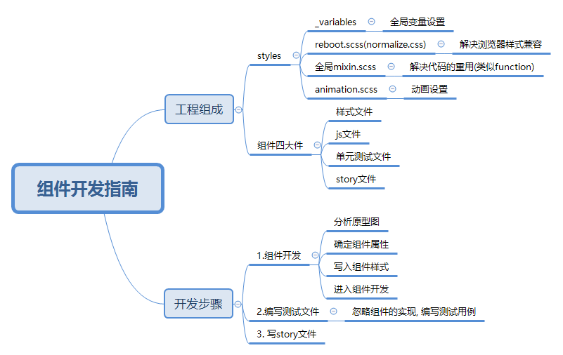

## 组件开发指南



### 组件架构

> 目录结构

```
  |--.storybook storybook相关配置 
  |--public
  |--src
      |-- components
         |--Button
            |--button.tsx
            |--button.test.tsx
            |--style.scss 组件单独样式
      |-- styles 全局样式文件
        _variables.scss (各种变量以及可配置设置)
        _minxins.scss (全局mixins)
        _functions.scss (全局functions)
        index.scss (样式入口文件)
      |-- hooks自定义hooks
├─src
|  ├─index.tsx
|  ├─welcome.stories.tsx
|  ├─styles
|  |   ├─index.scss: 样式入口文件
|  |   ├─_animation.scss
|  |   ├─_functions.scss
|  |   ├─_mixin.scss: 全局mixins
|  |   ├─_reboot.scss
|  |   └_variables.scss: 各种变量以及可配置设置
|  ├─hooks
|  |   ├─useClickOutSide.tsx
|  |   └useDebounce.tsx
|  ├─components
|  |     ├─Upload
|  |     |   ├─dragger.tsx
|  |     |   ├─index.tsx
|  |     |   ├─upload.stories.tsx
|  |     |   ├─upload.test.tsx
|  |     |   ├─upload.tsx
|  |     |   ├─uploadList.tsx
|  |     |   └_style.scss
|  |     ├─Transition
|  |     |     └transition.tsx
|  |     ├─Progress
|  |     |    ├─progress.tsx
|  |     |    └_style.scss
|  |     ├─Menu
|  |     |  ├─index.tsx
|  |     |  ├─menu.stories.tsx
|  |     |  ├─menu.test.tsx
|  |     |  ├─menu.tsx
|  |     |  ├─menuItem.tsx
|  |     |  ├─subMenu.tsx
|  |     |  └_style.scss
|  |     ├─Input
|  |     |   ├─index.tsx
|  |     |   ├─input.stories.tsx
|  |     |   ├─input.test.tsx
|  |     |   ├─input.tsx
|  |     |   └_style.scss
|  |     ├─Icon
|  |     |  ├─icon.stories.tsx
|  |     |  ├─icon.tsx
|  |     |  ├─index.tsx
|  |     |  └_style.scss
|  |     ├─Button
|  |     |   ├─button.stories.tsx
|  |     |   ├─button.test.tsx
|  |     |   ├─button.tsx
|  |     |   ├─index.tsx
|  |     |   └_style.scss
|  |     ├─AutoComplete
|  |     |      ├─autoComplete.stories.tsx
|  |     |      ├─autoComplete.test.tsx
|  |     |      ├─autoComplete.tsx
|  |     |      ├─index.tsx
|  |     |      └_style.scss
|  |     ├─Alert
|  |     |   ├─alert.stories.tsx
|  |     |   ├─alert.test.tsx
|  |     |   ├─alert.tsx
|  |     |   ├─index.tsx
|  |     |   └_style.scss
├─.storybook
|     ├─main.js
|     └preview.tsx
```

> 代码规范

- CRA自带项目规范; .eslintrc中配置相关规则; 
注意: 开启vscode编辑器 ESLint按钮


### 基础知识

> React基础

- 状态提升 or 单项数据流

  通常可变的数据都有一个单一的数据流

- 配置React开发环境
  create-react-app 安装: npx create-react-app my-app --typescript
  **npx 作用**: 会将node_modules/bin加入path变量; 结束后删除
  1. 避免安装全局模块
  2. 调用内部安装模块 如: npx mocha --version

- Hook规则

  1. 只在最顶层使用Hook
  2. 只在函数中调用Hook

### 组件开发

> [样式解决方案](https://reactjs.org/docs/faq-styling.html)

  1. inlineStyle: class性能要比style好很多
  2. CSS in JS: 如 style Component; React 中立态度; 不建议使用
  3. Sass/Less: 推荐

> Q: 如何创建组件库的色彩体系

  1. 创建系统色板 - 基础色板 + 中性色板 [色板](http://zhongguose.com/)
  ```
  所谓的中性色板: 从白色到黑色之间一组变量值;
       基础色板: 定义一些常规的颜色变量 red、purple、blue等
       系统色板: 系统的主打颜色  primary + secondery
  ```
  ```scss
  // !default scss提供的, 用户定义后 不在赋值
  $white:    #fff !default;
  $gray-100: #f8f9fa !default;
  $gray-200: #e9ecef !default;
  $gray-300: #dee2e6 !default;
  $gray-400: #ced4da !default;
  $gray-500: #adb5bd !default;
  $gray-600: #6c757d !default;
  $gray-700: #495057 !default;
  $gray-800: #343a40 !default;
  $gray-900: #212529 !default;
  $black:    #000 !default;

  // 基础色板
  $blue:    #0d6efd !default;
  $indigo:  #6610f2 !default;
  $purple:  #6f42c1 !default;
  $pink:    #d63384 !default;
  $red:     #dc3545 !default;
  $orange:  #fd7e14 !default;
  $yellow:  #fadb14 !default;
  $green:   #52c41a !default;
  $teal:    #20c997 !default;
  $cyan:    #17a2b8 !default;

  // 系统色板
  $primary:       $blue !default;
  $secondary:     $gray-600 !default;
  ```

  2. 创建产品色板: 即是一些功能色
  ```scss
    $success:       $green !default;
    $info:          $cyan !default;
    $warning:       $yellow !default;
    $danger:        $red !default;
    $light:         $gray-100 !default;
    $dark:          $gray-800 !default;
  ```

  3. 引入normalize.css: 解决不同浏览器兼容问题

  4. 创建scss全局变量
     
    基础的色彩体系
    字体系统(字体家族、大小、字重等)
    表单
    按钮
    边框和阴影
    可配置的开关

  5. 创建入口文件index.scss; 包含要导出的相关scss
  
  **注意:** _ 称为partials 告诉scss不要编译到css文件; 只能被导入

> Q: 如何开发组件？
  
  一个组件应包含哪些文件: 主体文件、样式文件、story文件、test文件
  ```
  以开发Button组件为例:
  1: 明确需求，确定Button Type、Button Size、Disabled状态; 编写JS组件
  2: 写入组件样式 按钮的大小由padding、font-size、border-radius控制; 
  颜色由border-color、background、color控制
  3: mixin解决重复代码问题
  4: 原生属性支持ButtonHTMLAttributes<HTMLElement>获取所有的btn原生属性
  ```
> Q: 如何开发Menu组件
  1. 需求分析
    基本样式 - 横向、纵向
    item: 支持active、disabled、切换tab、下拉框

  2. 方案:要让组件更加语义化、更加像HTML的解决方案
  ```jsx
    <Menu>
      <Menu.Item>12</Menu.Item>
      <Menu.Item>13</Menu.Item>
    </Menu>
  ```
  3. 属性分析
    MenuProps
    MenuItemProps

> Q: 如何开发Icon组件

- 图标的发展历史?
  
  雪碧图 -> Font Icon -> 现代和未来 SVG

- SVG都有哪些优势？

1. 完全可控
2. SVG即取即用,Font Icon要下载全部字体文件
3. Font Icon还有奇怪的Bug, 如文件加载失败出现奇怪的bug 如方块
  
- 如何获取SVG?

1. Font Awesome提供丰富的SVG组件库，react-fontawesome提供React使用组件;

2. 如何使图标动起来? 请看动画解决方案

> Q: 动画解决方案

1. transition + transform

这种方案局限性: 第一种方案局限性, 不能解决带延时的动画

2. 理想方案:
```
  display: none -> display: block  -(动画效果)->  display: block
                   opacity: 0          opacity: 1

  display: block -(动画效果)-> display: block -> display: none
  opacity: 1        opacity: 0 
```
**现实：** css 无法实现;
**React官方提供的解决方案:**
React Transition Group: 不是一个animation库; 是提供一个entering态和exiting态过度方案;

最新版包含了4种Component: 使用CSSTransition
```
*-enter -(forces a reflow)-> *.enter.active -(timeout)-> *-enter-done
*-exit  -(forces a reflow)-> *.exit.active -(timeout)-> *-exit-done
```
unmountOnExit属性很重要；动态挂载节点的能力

> 如何开发Upload组件

- 需求分析:
```
开始 -(点击按钮)-> beforeUpload(file) -> onProgress(event, file) -> onChange(file) -> onSuccess(response, file) -(删除按钮)-> onRemove() 
       -> onError()
```

- 发送数据使用工具分析

  fetch缺点:
  1. 只对网络请求报错, 对400、500都当做成功的请求
  2. 默认不会带cookie
  3. 不支持abort，不支持超时控制
  4. 没有办法原生检测请求的的进度

  axios: 下一代xhr

- 线上的Mock Server

  jsonplaceholder、mockyio

- 上传文件的基本方式

  ```
  form 表单 encType: 
      multipart/form-data
      application/x-www-form-urlencode
      text/plain
  ```
  xhr模拟表单数据 new FormData

- 组件测试用例分析和编码

> Q: 为什么要有测试
  
  有测试对代码升级叫重构;没测试代码升级叫重写;
 
  作用:
  1. 高质量的代码
  2. 更早的发现bug,减少成本
  3. 让重构和升级更加容易和升级
  4. 让开发流程更加敏捷
```flow
  st=>start: Start
  op=>operation: Unit
  op=>operation: Service
  op=>operation: Service
  e=>end: End
```
  React组件类型更加合适写单元测试
  1. Component - 组件
  2. Function - 函数
  3. 单项数据流
> Q: 如何搭建组件测试架构
  
  1. Jest框架 
  2. React Testing Library
  3. jest-dom: 新增DOM断言 
  对JEST matchers 进行扩展import '@testing-library/jest-dom/extend-expect';

  使用如上三个库,搭建项目测试框架
  
> Q: 异步怎样测试？ 

  jest.mock('axios');
  async await
  hover显示元素的测试
```js
  jest.mock("../Icon/icon", () => {
    return ({icon, onClick}: any) => {
      return <span onClick={onClick}>{icon}</span>
    }
  });
```
> Q: Drag事件测试?

主要是解决fireEvent.drop事件; 原因react testing中jsdom不支持dataTransfer.files

fireEvent.drop
```js
  const fileDropEvent  = createEvent.drop(uploadArea);
  Object.defineProperty(fileDropEvent, "dataTransfer", {
    value: {
      files: [testFile]
    }
  });
  fireEvent(uploadArea, fileDropEvent)
```

> storybook 解决本地调试和文档页面生成利器

**CRA缺点:**

1. CRA 入口文件不合适管理组件库
2. 缺少行为追踪和属性

>Q: 完美的组件应具有什么特点?

1. 具有分开展示各个组件不同属性下的状态
2. 具有能追踪组件行为并具有属性调试功能
3. 具有为组件自动生成生成文档和属性列表

storybook完美解决上述问题

>Q: storybook 安装使用

1. npm run @storybook/react

2. storybook支持typescript
  ```
    在.storybook添加相关配置;
    在每一个组件中加入自己的story文件button.stories.tsx
    react-docgen: 处理注释显示 显示出来
  ```
2. 安装addons 
cnpm i @storybook/addon-actions @storybook/addon-links @storybook/addon-essentials -D

### 模块化
- 一组可重用的代码
- 可维护性
- 可重用性

```js
// common.js
const bar = require('./bar');
module.exports = function(){}

// AMD
define(function(require){
  // 通过相对路径获取得依赖路径
  const bar = require('./bar');
  // 模块产出
  return function(){}
});

// es6 
import bar from './bar';
export default bar;
```

bundler神奇功效: webpack、parcel

**tsx: 打包流程**

```
Typescript file -(tsc)-> es6: .jsx -> 入口文件引用需要的文件index.tsx -> module bulder -> 浏览器可以使用的一个或多个js文件
```
> Q: 怎样选择js模块格式

UMD: 无法使用按需加载; 对比完成相关模块优劣势；决定使用es module

步骤: 创建入口文件; 

package.json: main、module字段定义

```ts
  "main": "dist/index.js",
  "module": "dist/index.js",
  "types": "dist/index.d.ts",
```

tsconfig配置: 分开发、和打包两种模式

查看官网: 可以查询相关的知识点

ts处理模块的方式: 和node js不一样

模块加载分成两种路径：relative, non-relative
ts默认是classic

需要编译scss

> Q: 本地测试组件库

npm link: 在要被目录中执行npm link
创建软连接到全局

到要使用组件的地方npm link 上述项目名称; 需要在package.json添加
相应的字段

"main": "dist/index.js",
"module": "dist/index.js",
"types": "dist/index.d.ts",

解决React版本不不一致的问题，使用peerDependencies

>Q: 上传npm包管理平台

完善package.json
files: []; // 表示要上传npm中去文件
prepublish: 钩子函数

>Q: 精简package.json依赖项  

commit前: 验证代码规范; cra 自带eslint

### 易错知识点

1. a 标签没有disabled? 加上disabled属性模拟实现


> TS 常用的知识点

Partial<T> : 属性可选
Omit<T, propName> :忽略掉属性 